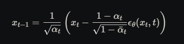

There are two different outputs we can get:
(A) An array of 'landmarks', where each landmark has an associated joint and (x, y) coordinate
These outputs produce synthetic heatmaps where we add gaussian splattering depending on the confidence

(B) An actual heatmap of probabilities of where a joint is

We could use either model and change our objective.
For output (A), we can see how rgb crops and edge detection with a diffusion model improve the accuracy of joint positioning
For output (B), we can refine the heatmap based on the shape of the probabilites

# OPENPOSE

Pros:
Produces output (B)

Cons:
Only works on CPU (not real time)
Only works on Windows

# MEDIAPIPE

Pros:
Easy to run with a simple python script
Real time

Cons:
Produces output (A)

MediaPipe

# MMPOSE

Pros:
Produces Output (B)
Real Time

Cons:
Painful to setup on windows - requires specific versions of libraries and cuda, requires community built wheels.
Might be better on MAC

MMPose has a variety of different models that can be run.
The setup is very specific to the machine you are on.
For windows, you need a specific pytorch version, cuda version pair to download the pre-built wheels.
These pre-built wheels first need to be downloaded from: https://miropsota.github.io/torch_packages_builder/mmcv/
Other than that, follow the instructions on the website.

# TODO

A) Edge detection/RGB crops. DONE
B) Jitter

